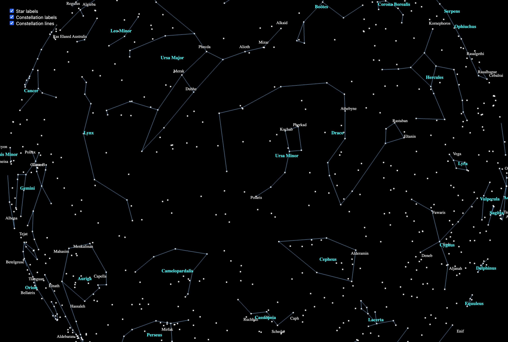

# Star-Map Viewer (Three.js + Vite)

An interactive, browser-based **planetarium** that renders the 1 000–2 000 brightest stars, IAU constellation lines, and ecliptic on a virtual celestial sphere.  
Built with **Three.js** for WebGL rendering, **three-stdlib** for helpers, and **Vite** for zero-config bundling / hot-reload.

<div align="center">
  
</div>

---

## 0. Contents

| Folder               | Role                                                                                                       |
| -------------------- | ---------------------------------------------------------------------------------------------------------- |
| `src/loaders/`       | **Data Model layer** – fetch + parse raw CSV into plain JS objects / `Map`s (no Three.js here).            |
| `src/view/`          | **View layer** – convert data into Three.js meshes / groups (createStarField, createConstellations, etc.). |
| `src/utils/`         | Shared math helpers (`raDecToVec3`, angle conversions…).                                                   |
| `src/dom/`           | UI widgets (checkbox panel, sliders) – all DOM concerns live here.                                         |
| `src/three-scene.js` | Scene bootstrap: builds `scene`, `camera`, renderers, `OrbitControls`, resize handler.                     |
| `main.js`            | Thin “scene builder” that wires the loaders, views, and UI together.                                       |

---

## 1. Data sources & licensing

All astronomy catalogue files are derived from the open datasets distributed with **[Stellarium](https://stellarium.org/)**:

- `stars*.csv` – positions, magnitudes, proper names.
- `ConstellationLines.csv` – IAU line segments for 88 constellations.

See `data/LICENSE.md` for Stellarium’s original GNU GPL notice and attribution.  
This viewer does **not** embed any Stellarium code—only the public CSV exports.

---

## 2 Architecture

The code base deliberately **separates the data model from the view** to keep each layer simple, testable and swappable.

### 2.1 Data-model layer (`src/loaders/` + `public/`)

- **Purpose** – Turn raw CSV into plain JavaScript structures with _no_ Three.js dependencies.
- **Characteristics**
  • Pure, deterministic functions: given a URL/string → returns objects.  
  • Easy to unit-test (mock `fetch`, inspect returned maps).  
  • Decoupled from rendering details – the same loaders could back a WebGPU or Node CLI version.
- **Public dir** - hold the data, e.g., stars1000.csv

Example: `loadStarMap()` returns `Map<hr, { ra, dec, mag, name }>`; there is no geometry or DOM work here.

### 2.2 View layer (`src/view/`)

- **Purpose** – Convert data-model objects into **renderable Three.js objects**.
- **Factory contract** – Each factory returns the same trio:

      {
        group,      // a THREE.Group or mesh ready to add to the scene
        labels,     // optional array of CSS2DObject name labels
        dispose     // function that frees GPU resources when you remove the group
      }

- **Why a single `group`?**
  • The caller does exactly one `scene.add(group)` per layer, minimising omissions.  
  • Internally the factory may add sub-meshes, CSS2D labels, etc., but they’re all children of that group.

- **Side-effect free** – The factory never touches the global `scene`; the caller decides where to place the result.

### 2.3 Scene bootstrap (`src/three-scene.js`)

- Owns core infrastructure: `scene`, orthographic `camera`, WebGL & CSS2D renderers, `OrbitControls`, and the resize handler.
- Exposes a `dispose()` method so tests or hot-reload can tear down the WebGL context cleanly.

### 2.4 UI layer (`src/dom/`)

- Pure DOM/CSS – builds the checkbox panel, sliders, etc.
- Talks to the view layer **only** through public properties (`object.visible = false`) – no hidden data coupling.

### 2.5 Composition (`main.js`)

- Loads data → builds view groups → adds them to the scene → hands references to the UI widgets.
- Contains almost _no_ rendering logic; it’s glue code that could later be replaced by a React/Svelte component without touching loaders or view factories.

This separation means:

- label positioning is handled in the **view** layer,
- CSV parsing is handled in the **loader** directory,
- checkboxes, or other 2D overlays are in **dom/ui**.

## 3. Quick Start

git clone https://github.com/your-user/star-map-viewer  
cd star-map-viewer

### 1 Install dependencies

```bash
npm install # (three, three-stdlib, vite, papaparse, …)
```

### 2 Run dev server with hot-reload

```bash
npx vite
```

open http://localhost:5173 (default) in your browser

## 4. TO DO

See starVis/TODO.md
